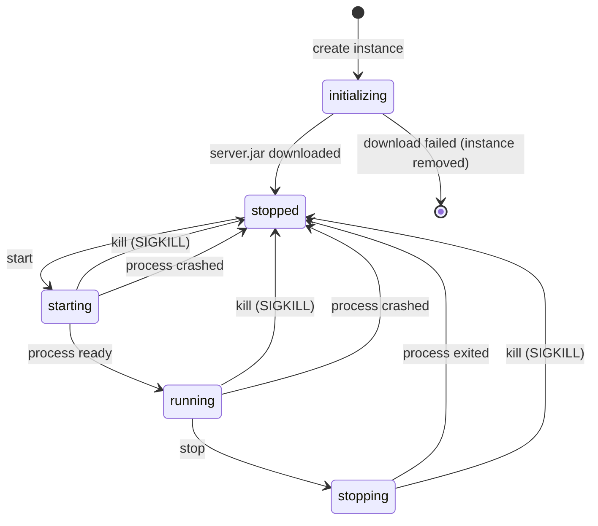

# Conduit MC — API Protocol Specification

> Version: 0.1-draft \
> Last updated: 2026-04-30 \
> Status: Daemon implemented — all 54 REST endpoints + WebSocket channels landed; 187 automated tests passing; security audit complete. Events/messages marked ⚠️ below are reserved in the spec but not yet emitted/handled (tracked in `progress.md`).

This document defines the communication protocol between the two Conduit MC
components: **Daemon** and **Desktop**. The Desktop app is a unified application
with two functional areas: **server management** (admin) and **game launcher**
(player). A future **Web panel** (WasmJS) will consume the same management API.
This document serves as the single source of truth for implementors.

---

## Table of Contents

1. [Conventions](#1-conventions)
2. [Pair Token Flow](#2-pair-token-flow)
3. [Instance Management](#3-instance-management)
4. [Desktop–Daemon REST API (per-instance)](#4-desktopdaemon-rest-api-per-instance)
5. [WebSocket Protocol (Desktop–Daemon)](#5-websocket-protocol-desktopdaemon)
6. [Public Endpoints (Launcher–Daemon)](#6-public-endpoints-launcherdaemon)
7. [`server.json` Schema](#7-serverjson-schema)
8. [Invite Link Format](#8-invite-link-format)
9. [Error Handling](#9-error-handling)
10. [Security Considerations](#10-security-considerations)
11. [Appendix](#11-appendix)

---

## 1. Conventions

| Item | Value |
|------|-------|
| Base URL | `https://{daemon-host}:{port}` |
| Default Daemon port | `9147` |
| Management API prefix | `/api/v1/` |
| Public endpoint prefix | `/public/` |
| Content type | `application/json` (all request/response bodies) |
| Authentication | `Authorization: Bearer {token}` header |
| Versioning | Path-based (`/api/v1/`); bumped only on breaking changes |
| Timestamps | ISO 8601 UTC (`2026-04-24T12:00:00Z`) |
| Instance-scoped paths | `/api/v1/instances/{instanceId}/...` |

All management API endpoints (under `/api/v1/`) require a valid Bearer token
unless explicitly noted otherwise. Public endpoints (under `/public/`) require
no authentication.

---

## 2. Pair Token Flow

Pairing establishes trust between a Desktop app and the Daemon. The Daemon
supports **multiple paired devices** — the same owner can manage from different
machines, each receiving its own independent token.

### 2.1 Initiate Pairing

**`POST /api/v1/pair/initiate`** — Conditional auth.

Generates a one-time 6-digit numeric pairing code.

- **First pairing** (no devices paired yet): no auth required. The Daemon is
  in "setup mode" and accepts the request from anyone on the network.
- **Subsequent pairings** (at least one device already paired): requires a
  valid Bearer token. This prevents unauthorized devices from generating codes.
- **Alternative**: always generate via the Daemon CLI (`conduit pair`), which
  outputs the code to stdout. This is the recommended flow when SSH access is
  available.

**Response `201 Created`:**

```json
{
  "code": "482916",
  "expiresAt": "2026-04-24T12:05:00Z"
}
```

- Code: 6-digit numeric, single-use, expires in 5 minutes.
- Only one active code at a time; generating a new code invalidates the previous one.

### 2.2 Confirm Pairing

**`POST /api/v1/pair/confirm`** — No auth required.

The Desktop app submits the pairing code along with a device name.

**Request:**

```json
{
  "code": "482916",
  "deviceName": "Adam's MacBook"
}
```

**Response `200 OK`:**

```json
{
  "token": "conduit_a1b2c3d4e5f6...",
  "tokenId": "f47ac10b-58cc-4372-a567-0e02b2c3d479",
  "daemonId": "d290f1ee-6c54-4b01-90e6-d701748f0851"
}
```

- `token`: 64-character cryptographically random string, Base62, prefixed with `conduit_`.
- `tokenId`: UUID identifying this specific device/token pair, used for revocation.
- `daemonId`: UUID identifying this Daemon instance, used by the Desktop app to detect re-pairing to a different Daemon.

**Error responses:**

| Status | Code | Description |
|--------|------|-------------|
| 401 | `INVALID_PAIR_CODE` | Code does not match |
| 401 | `PAIR_CODE_EXPIRED` | Code has expired |
| 429 | `RATE_LIMITED` | Too many attempts (max 5/min/IP) |

### 2.3 List Paired Devices

**`GET /api/v1/pair/devices`** — Requires auth.

**Response `200 OK`:**

```json
[
  {
    "tokenId": "f47ac10b-58cc-4372-a567-0e02b2c3d479",
    "deviceName": "Adam's MacBook",
    "pairedAt": "2026-04-20T08:30:00Z",
    "lastSeenAt": "2026-04-24T11:45:00Z"
  },
  {
    "tokenId": "b23dc4e5-1234-5678-abcd-ef0123456789",
    "deviceName": "Adam's PC",
    "pairedAt": "2026-04-22T19:00:00Z",
    "lastSeenAt": "2026-04-23T22:10:00Z"
  }
]
```

`lastSeenAt` updates on every authenticated API request from that device,
helping identify stale devices.

### 2.4 Revoke a Device

**`DELETE /api/v1/pair/devices/{tokenId}`** — Requires auth.

Revokes a single device's token. The token becomes immediately invalid.

**Response `204 No Content`.**

A device can revoke its own token (effectively "unpair this device").

### 2.5 Revoke All Devices

**`DELETE /api/v1/pair/devices`** — Requires auth.

Revokes **all** paired devices. The Daemon returns to a fully unpaired state.
This is a destructive operation — the requesting device's own token is also
invalidated.

**Response `204 No Content`.**

### 2.6 Token Lifecycle

- **Storage**: Daemon stores a SHA-256 hash of each token. The Desktop app stores the plaintext token in OS keychain or config file.
- **Lifetime**: Tokens do not expire. Revocation is the only way to invalidate them.
- **Permissions**: All devices share the same full-access permission level. There is no role-based access control.
- **Format**: `conduit_` prefix + 64 Base62 characters (total 72 chars). The prefix makes tokens greppable in logs and config files.

---

## 3. Instance Management

The Daemon is a **server-side launcher** that manages multiple independent
Minecraft server instances. Each instance has its own loader, mods, config,
and game server port.

### 3.1 List Instances

**`GET /api/v1/instances`** — Requires auth.

**Response `200 OK`:**

```json
[
  {
    "id": "a3kx9",
    "name": "Survival Server",
    "description": "Main survival world",
    "state": "running",
    "mcVersion": "1.20.4",
    "loader": { "type": "neoforge", "version": "20.4.237" },
    "mcPort": 25565,
    "playerCount": 3,
    "maxPlayers": 20,
    "createdAt": "2026-04-20T08:00:00Z"
  },
  {
    "id": "b7mw2",
    "name": "Creative Server",
    "description": null,
    "state": "stopped",
    "mcVersion": "1.20.4",
    "loader": null,
    "mcPort": 25566,
    "playerCount": 0,
    "maxPlayers": 20,
    "createdAt": "2026-04-22T14:30:00Z"
  }
]
```

### 3.2 Create Instance

**`POST /api/v1/instances`** — Requires auth.

**Request:**

```json
{
  "name": "Survival Server",
  "mcVersion": "1.20.4",
  "description": "Main survival world",
  "mcPort": 25565,
  "jvmArgs": ["-Xmx4G", "-Xms2G"],
  "javaPath": null
}
```

| Field | Type | Required | Description |
|-------|------|----------|-------------|
| `name` | string | yes | Display name (max 64 chars, must be unique) |
| `mcVersion` | string | yes | Minecraft version (e.g., `"1.20.4"`) |
| `description` | string | no | Short description (max 256 chars) |
| `mcPort` | integer | no | MC server port. Auto-assigned if omitted (starting from 25565) |
| `jvmArgs` | string[] | no | JVM arguments. If omitted, inherits Daemon `defaultJvmArgs`. |
| `javaPath` | string | no | Java executable path. If omitted, uses Daemon default. |

The Daemon downloads the correct `server.jar` for the specified `mcVersion`
automatically during instance creation (fetched from Mojang). Available
versions can be queried via `GET /api/v1/minecraft/versions`.

Instance creation is a **two-phase operation**: the instance metadata is
created immediately, then `server.jar` is downloaded in the background.

**Response `201 Created`:**

```json
{
  "id": "a3kx9",
  "name": "Survival Server",
  "description": "Main survival world",
  "state": "initializing",
  "mcVersion": "1.20.4",
  "loader": null,
  "mcPort": 25565,
  "createdAt": "2026-04-24T12:00:00Z",
  "taskId": "task_c4d5e6f7"
}
```

- `id`: 5-character Base36 alphanumeric short code, generated by the Daemon, URL-friendly.
- `state`: starts as `initializing` while `server.jar` is being downloaded.
  Transitions to `stopped` once the download completes. The download progress
  is reported via WebSocket (`task.progress` / `task.completed`).
- The instance cannot be started until initialization completes.

**Error responses:**

| Status | Code | Description |
|--------|------|-------------|
| 409 | `INSTANCE_NAME_CONFLICT` | An instance with this name already exists |
| 409 | `PORT_CONFLICT` | The specified MC port is already in use |
| 422 | `VALIDATION_ERROR` | Invalid field values |

### 3.3 Get Instance

**`GET /api/v1/instances/{id}`** — Requires auth.

Returns the same object structure as the list response, for a single instance.

**Error: `404 INSTANCE_NOT_FOUND`** if the ID does not exist.

### 3.4 Update Instance

**`PUT /api/v1/instances/{id}`** — Requires auth.

Updates instance metadata. Only the provided fields are updated.

**Request:**

```json
{
  "name": "Survival Server v2",
  "description": "Updated description"
}
```

Updatable fields: `name`, `description`. Changing `mcVersion` or `mcPort`
requires the server to be stopped and may involve re-configuring the loader.

**Response `200 OK`:** Updated instance object.

### 3.5 Delete Instance

**`DELETE /api/v1/instances/{id}`** — Requires auth.

Deletes an instance and all its data (mods, config, world). The instance
must be in `stopped` state.

**Response `204 No Content`.**

**Error: `409 INSTANCE_RUNNING`** if the instance is not stopped.

### 3.6 Retry Download

**`POST /api/v1/instances/{id}/retry-download`** — Requires auth.

Resets an instance from `stopped` (with failed download) back to
`initializing` and re-triggers the server JAR download. Useful when the
initial download failed due to network issues.

**Response `200 OK`:** Updated instance summary (same shape as Create
Instance response, with a new `taskId` for download tracking).

**Error: `409 INSTANCE_RUNNING`** if the instance is currently running.

---

## 4. Desktop–Daemon REST API (per-instance)

All endpoints in this section are scoped to a specific instance. The full path
prefix is:

```
/api/v1/instances/{instanceId}/
```

All endpoints require a valid Bearer token.

### 4.1 Server Lifecycle

#### Get Server Status

**`GET .../server/status`**

**Response `200 OK`:**

```json
{
  "state": "running",
  "playerCount": 3,
  "maxPlayers": 20,
  "players": ["Steve", "Alex", "Notch"],
  "uptime": 3600,
  "mcVersion": "1.20.4",
  "loader": {
    "type": "neoforge",
    "version": "20.4.237"
  },
  "memory": {
    "usedMb": 2048,
    "maxMb": 4096
  },
  "tps": 20.0
}
```

| Field | Type | Description |
|-------|------|-------------|
| `state` | string | One of: `initializing`, `stopped`, `starting`, `running`, `stopping` |
| `playerCount` | integer | Current online player count |
| `maxPlayers` | integer | Maximum player slots |
| `players` | string[] | List of online player names |
| `uptime` | integer | Seconds since server started (0 if stopped) |
| `memory` | object | JVM memory usage |
| `tps` | number | Ticks per second (null if stopped) |

#### Accept EULA

**`GET .../server/eula`**

Returns the current EULA acceptance status.

**Response `200 OK`:**

```json
{
  "accepted": false,
  "eulaUrl": "https://aka.ms/MinecraftEULA"
}
```

**`PUT .../server/eula`**

Accepts the Minecraft EULA. This must be done before the server can start for
the first time. Writes `eula=true` to the instance's `eula.txt`.

**Request:**

```json
{
  "accepted": true
}
```

**Response `200 OK`:** `{ "accepted": true }`

#### Start Server

**`POST .../server/start`**

Starts the Minecraft server process for this instance.

**Response `200 OK`:** Returns `ServerStatus` with `state: "starting"`.

Idempotent: if already running, returns current status.

**Errors:**

| Status | Code | Description |
|--------|------|-------------|
| 409 | `SERVER_ALREADY_RUNNING` | Server is in a transitional state |
| 409 | `EULA_NOT_ACCEPTED` | EULA must be accepted before starting |

#### Stop Server

**`POST .../server/stop`**

Sends a graceful `/stop` command to the Minecraft server.

**Response `200 OK`:** Returns `ServerStatus` with `state: "stopping"`.

**Error: `409 SERVER_NOT_RUNNING`** if already stopped.

#### Restart Server

**`POST .../server/restart`**

Equivalent to stop followed by start. If the server is stopped, it simply starts.

**Response `200 OK`:** Returns `ServerStatus`.

#### Kill Server

**`POST .../server/kill`**

Force-kills the server process (SIGKILL). Use only as a last resort.

**Response `200 OK`:** Returns `ServerStatus` with `state: "stopped"`.

**Error: `409 SERVER_NOT_RUNNING`** if already stopped.

#### Send Console Command

**`POST .../server/command`**

Sends a command to the Minecraft server's stdin. The command output is
streamed via WebSocket, not returned in this response.

**Request:**

```json
{
  "command": "say Hello everyone"
}
```

**Response `200 OK`:**

```json
{
  "accepted": true
}
```

**Error: `409 SERVER_NOT_RUNNING`** if the server is not in `running` state.

### 4.2 Loader Management

#### Get Current Loader

**`GET .../loader`**

**Response `200 OK`:**

```json
{
  "type": "neoforge",
  "version": "20.4.237",
  "mcVersion": "1.20.4"
}
```

Returns `null` body if no loader is installed.

#### List Available Loaders

**`GET .../loader/available`**

Returns available loader types and their versions for the instance's Minecraft
version.

**Response `200 OK`:**

```json
[
  {
    "type": "neoforge",
    "versions": ["20.4.237", "20.4.236", "20.4.235"]
  },
  {
    "type": "forge",
    "versions": ["49.0.31", "49.0.30"]
  },
  {
    "type": "fabric",
    "versions": ["0.15.6", "0.15.5"]
  }
]
```

#### Install Loader

**`POST .../loader/install`**

Installs a mod loader. This is a long-running operation — the endpoint returns
immediately with a task ID, and progress is reported via WebSocket.

**Request:**

```json
{
  "type": "neoforge",
  "version": "20.4.237"
}
```

**Response `202 Accepted`:**

```json
{
  "taskId": "task_7f3a9b2e",
  "type": "loader_install",
  "message": "Installing NeoForge 20.4.237..."
}
```

**Errors:**

| Status | Code | Description |
|--------|------|-------------|
| 409 | `SERVER_MUST_BE_STOPPED` | Server must be stopped before installing |
| 409 | `LOADER_ALREADY_INSTALLED` | Uninstall the current loader first |
| 422 | `VALIDATION_ERROR` | Invalid loader type or version |
| 422 | `UNSUPPORTED_MC_VERSION` | Forge installation requires Minecraft 1.17 or newer |

#### Uninstall Loader

**`DELETE .../loader`**

Removes the currently installed loader.

**Response `204 No Content`.**

**Errors:**

| Status | Code | Description |
|--------|------|-------------|
| 404 | `NO_LOADER_INSTALLED` | No loader to uninstall |
| 409 | `SERVER_MUST_BE_STOPPED` | Server must be stopped first |

### 4.3 Mod Management

Mods can come from two sources: **Modrinth** (installed by version ID, metadata
auto-fetched) or **custom upload** (user provides the jar file directly). Both
types are tracked in the same mod list and included in the mrpack.

#### List Installed Mods

**`GET .../mods`**

**Response `200 OK`:**

```json
[
  {
    "id": "f47ac10b-58cc-4372-a567-0e02b2c3d479",
    "source": "modrinth",
    "modrinthProjectId": "AANobbMI",
    "modrinthVersionId": "kYq5qkSL",
    "name": "Sodium",
    "version": "0.5.8",
    "fileName": "sodium-fabric-0.5.8+mc1.20.4.jar",
    "env": {
      "client": "required",
      "server": "optional"
    },
    "hashes": {
      "sha1": "abc123...",
      "sha512": "def456..."
    },
    "downloadUrl": "https://cdn.modrinth.com/data/AANobbMI/versions/kYq5qkSL/sodium-fabric-0.5.8%2Bmc1.20.4.jar",
    "fileSize": 1234567,
    "enabled": true
  },
  {
    "id": "c89d2f1a-4567-89ab-cdef-0123456789ab",
    "source": "custom",
    "modrinthProjectId": null,
    "modrinthVersionId": null,
    "name": "MyCustomMod",
    "version": "1.0.0",
    "fileName": "my-custom-mod-1.0.0.jar",
    "env": {
      "client": "required",
      "server": "required"
    },
    "hashes": {
      "sha1": "789abc...",
      "sha512": "012def..."
    },
    "downloadUrl": null,
    "fileSize": 567890,
    "enabled": true
  }
]
```

| Field | Type | Description |
|-------|------|-------------|
| `id` | string | Conduit's internal UUID for this mod entry |
| `source` | string | `"modrinth"` or `"custom"` |
| `modrinthProjectId` | string\|null | Modrinth project ID (`null` for custom mods) |
| `modrinthVersionId` | string\|null | Modrinth version ID (`null` for custom mods) |
| `env` | object | Environment markers (`client`/`server` each: `required`, `optional`, or `unsupported`) |
| `hashes` | object | File hashes (SHA-1 and SHA-512, computed by Daemon for custom mods) |
| `downloadUrl` | string\|null | CDN download URL for Modrinth mods; `null` for custom mods |
| `fileSize` | integer | File size in bytes |
| `enabled` | boolean | Whether this mod is active. Disabled mods are moved out of `mods/` but retained in metadata. |

#### Install Mod from Modrinth

**`POST .../mods`**

Installs a mod by its Modrinth version ID. The Daemon fetches metadata from
the Modrinth API and downloads the jar file to the instance's `mods/` directory.

**Request:**

```json
{
  "modrinthVersionId": "kYq5qkSL"
}
```

**Response `201 Created`:** Returns the `InstalledMod` object.

Installing a mod marks the instance's pack as dirty.

**Errors:**

| Status | Code | Description |
|--------|------|-------------|
| 409 | `MOD_ALREADY_INSTALLED` | This mod version is already installed |
| 502 | `MODRINTH_API_ERROR` | Failed to fetch mod metadata from Modrinth |
| 422 | `VALIDATION_ERROR` | Version ID not found or incompatible with instance |

#### Upload Custom Mod

**`POST .../mods/upload`**

Uploads a mod jar file directly. Use this for mods not available on Modrinth
(CurseForge-only mods, private mods, custom builds, etc.).

**Request:** `multipart/form-data`

| Field | Type | Required | Description |
|-------|------|----------|-------------|
| `file` | binary | yes | The `.jar` file |
| `name` | string | no | Display name (auto-detected from jar manifest if omitted) |
| `version` | string | no | Version string (auto-detected if omitted) |
| `env` | string | no | JSON object `{"client":"required","server":"required"}`. Defaults to `{"client":"required","server":"required"}` if omitted. |

**Response `201 Created`:** Returns the `InstalledMod` object with `source: "custom"`.

The Daemon computes SHA-1 and SHA-512 hashes for the uploaded file. Marks the
pack as dirty.

**Errors:**

| Status | Code | Description |
|--------|------|-------------|
| 409 | `MOD_ALREADY_INSTALLED` | A mod with identical hash already exists |
| 413 | `FILE_TOO_LARGE` | File exceeds upload size limit (default 256 MB) |
| 422 | `VALIDATION_ERROR` | File is not a valid jar |

**mrpack handling for custom mods:** Custom mods have no CDN URL, so the Daemon
hosts them on a dedicated public endpoint:
`GET /public/{instanceId}/mods/{fileName}`. The mrpack references this URL.
This is the **only** case where the Daemon serves mod files directly — it is
limited to user-uploaded files, not re-distribution of third-party mods.

#### Remove Mod

**`DELETE .../mods/{modId}`**

Removes a mod from the instance. `modId` is Conduit's internal UUID.

**Response `204 No Content`.**

Marks the pack as dirty.

**Error: `404 MOD_NOT_FOUND`.**

#### Update Mod

**`PUT .../mods/{modId}`**

Updates a Modrinth mod to a different version. For custom mods, delete and
re-upload with the new file.

**Request:**

```json
{
  "modrinthVersionId": "newVersionId123"
}
```

**Response `200 OK`:** Returns the updated `InstalledMod` object.

Marks the pack as dirty.

**Error: `422 VALIDATION_ERROR`** if the mod is a custom mod (use upload instead).

#### Toggle Mod

**`PATCH .../mods/{modId}`**

Enables or disables a mod without removing it. Disabled mods are excluded from
the `mods/` directory and the mrpack, but their metadata is preserved for easy
re-enabling.

**Request:**

```json
{
  "enabled": false
}
```

**Response `200 OK`:** Returns the updated `InstalledMod` object.

Marks the pack as dirty.

### 4.4 Modrinth Search (Global)

**`GET /api/v1/modrinth/search`** — Requires auth.

Proxies search requests to the Modrinth API. The Daemon acts as a proxy to
avoid CORS issues and enable caching.

**Query parameters:**

| Parameter | Type | Required | Description |
|-----------|------|----------|-------------|
| `q` | string | yes | Search query |
| `mcVersion` | string | no | Filter by Minecraft version |
| `loader` | string | no | Filter by loader type |
| `offset` | integer | no | Pagination offset (default: 0) |
| `limit` | integer | no | Results per page (default: 20, max: 100) |

**Response `200 OK`:**

```json
{
  "hits": [
    {
      "projectId": "AANobbMI",
      "slug": "sodium",
      "title": "Sodium",
      "description": "A modern rendering engine for Minecraft",
      "author": "jellysquid3",
      "iconUrl": "https://cdn.modrinth.com/data/AANobbMI/icon.png",
      "downloads": 5000000,
      "latestVersion": "0.5.8",
      "categories": ["optimization"],
      "env": {
        "client": "required",
        "server": "unsupported"
      }
    }
  ],
  "totalHits": 150,
  "offset": 0,
  "limit": 20
}
```

**Error: `502 MODRINTH_API_ERROR`** if the Modrinth API is unreachable.

#### Get Modrinth Project Versions (Global)

**`GET /api/v1/modrinth/project/{projectId}/versions`** — Requires auth.

Returns available versions of a specific Modrinth project, filtered by the
instance's MC version and loader. Used when the user selects a search result
and needs to pick which version to install.

**Query parameters:**

| Parameter | Type | Required | Description |
|-----------|------|----------|-------------|
| `mcVersion` | string | no | Filter by Minecraft version |
| `loader` | string | no | Filter by loader type |

**Response `200 OK`:**

```json
[
  {
    "versionId": "kYq5qkSL",
    "versionNumber": "0.5.8",
    "name": "Sodium 0.5.8",
    "changelog": "Fixed a rendering bug...",
    "gameVersions": ["1.20.4", "1.20.3"],
    "loaders": ["fabric", "quilt"],
    "datePublished": "2024-01-15T00:00:00Z",
    "files": [
      {
        "fileName": "sodium-fabric-0.5.8+mc1.20.4.jar",
        "fileSize": 1234567,
        "hashes": { "sha1": "abc123...", "sha512": "def456..." }
      }
    ],
    "dependencies": [
      {
        "projectId": "P7dR8mSH",
        "projectName": "Fabric API",
        "dependencyType": "required"
      }
    ]
  }
]
```

`dependencies[].dependencyType`: one of `required`, `optional`, `incompatible`.
The Desktop app should display required dependencies and offer to install them
alongside the selected mod.

**Error: `502 MODRINTH_API_ERROR`** if the Modrinth API is unreachable.

#### Check Mod Updates (per-instance)

**`GET .../mods/updates`**

Checks all installed Modrinth-sourced mods for available updates, filtered by
the instance's MC version and loader. Custom mods are skipped.

**Response `200 OK`:**

```json
{
  "updatesAvailable": 3,
  "mods": [
    {
      "modId": "f47ac10b-58cc-4372-a567-0e02b2c3d479",
      "name": "Sodium",
      "currentVersion": "0.5.8",
      "latestVersion": "0.6.0",
      "latestVersionId": "newVersionId456",
      "changelog": "Major performance improvements..."
    }
  ]
}
```

Only mods with an available update are included in the `mods` array. Mods
where the installed version is already the latest are omitted.

**Error: `502 MODRINTH_API_ERROR`** if the Modrinth API is unreachable.

### 4.5 Pack Management

#### Get Pack Info

**`GET .../pack`**

**Response `200 OK`:**

```json
{
  "name": "Survival Server Pack",
  "versionId": "1.0.3",
  "lastBuiltAt": "2026-04-24T10:00:00Z",
  "dirty": true,
  "fileSize": 45678,
  "modCount": 15,
  "hash": {
    "sha256": "abcdef1234567890..."
  }
}
```

| Field | Type | Description |
|-------|------|-------------|
| `dirty` | boolean | `true` if mods have changed since last build |
| `versionId` | string | User-defined or auto-incremented version |

**Error: `404 PACK_NOT_BUILT`** if no pack has been built yet.

#### Build Pack

**`POST .../pack/build`**

Triggers an mrpack rebuild. The mrpack contains mod references (URL + hash),
not the jar files themselves. This is a potentially long operation.

**Request (optional):**

```json
{
  "versionId": "1.0.4",
  "summary": "Added Sodium"
}
```

If `versionId` is omitted, the Daemon auto-increments the patch version.

**Response `202 Accepted`:**

```json
{
  "taskId": "task_b2c3d4e5",
  "type": "pack_build",
  "message": "Building pack..."
}
```

**Error: `409 PACK_BUILD_IN_PROGRESS`** if a build is already running.

#### Get Build Status

**`GET .../pack/build/status`**

**Response `200 OK`:**

```json
{
  "state": "building",
  "progress": 0.75,
  "message": "Generating modrinth.index.json..."
}
```

`state`: one of `idle`, `building`, `done`, `error`.

### 4.6 Server Configuration

#### Get server.properties

**`GET .../config/server-properties`**

Returns the Minecraft `server.properties` file as a JSON object.

**Response `200 OK`:**

```json
{
  "server-port": 25565,
  "max-players": 20,
  "motd": "A Conduit MC Server",
  "online-mode": true,
  "difficulty": "normal",
  "gamemode": "survival",
  "level-name": "world"
}
```

#### Update server.properties

**`PUT .../config/server-properties`**

Updates one or more `server.properties` fields. Only the provided fields are
updated; omitted fields remain unchanged.

**Request:**

```json
{
  "max-players": 30,
  "motd": "Welcome to my server!"
}
```

**Response `200 OK`:**

```json
{
  "updated": ["max-players", "motd"],
  "restartRequired": true
}
```

`restartRequired` is `true` when the changes take effect only after a server
restart.

### 4.7 Instance File Management

A general-purpose file browser scoped to the instance directory. Covers all
configuration needs: mod configs (`config/`), player management files
(`ops.json`, `whitelist.json`), datapack management (`world/datapacks/`), and
any mod-specific directories (e.g., `bluemap/`, `dynmap/`).

#### List Directory

**`GET .../files?path={dirPath}`**

Lists files and subdirectories at the given path. `path` is relative to the
instance root directory. Defaults to `/` (instance root) if omitted.

**Query parameters:**

| Parameter | Type | Required | Default | Description |
|-----------|------|----------|---------|-------------|
| `path` | string | no | `/` | Relative directory path |

**Response `200 OK`:**

```json
{
  "path": "/",
  "entries": [
    { "name": "config",            "type": "directory", "size": null,  "lastModified": "2026-04-24T10:30:00Z" },
    { "name": "mods",              "type": "directory", "size": null,  "lastModified": "2026-04-24T11:00:00Z" },
    { "name": "world",             "type": "directory", "size": null,  "lastModified": "2026-04-24T12:00:00Z" },
    { "name": "logs",              "type": "directory", "size": null,  "lastModified": "2026-04-24T12:00:00Z" },
    { "name": "server.properties", "type": "file",      "size": 1024, "lastModified": "2026-04-24T09:00:00Z" },
    { "name": "ops.json",          "type": "file",      "size": 256,  "lastModified": "2026-04-23T18:00:00Z" },
    { "name": "whitelist.json",    "type": "file",      "size": 128,  "lastModified": "2026-04-22T12:00:00Z" },
    { "name": "banned-players.json","type": "file",     "size": 2,    "lastModified": "2026-04-20T08:00:00Z" }
  ]
}
```

Example: `GET .../files?path=config` returns the contents of the `config/` directory:

```json
{
  "path": "config",
  "entries": [
    { "name": "sodium-options.json",  "type": "file",      "size": 2048, "lastModified": "2026-04-24T10:30:00Z" },
    { "name": "create",               "type": "directory", "size": null,  "lastModified": "2026-04-23T18:00:00Z" },
    { "name": "jei",                  "type": "directory", "size": null,  "lastModified": "2026-04-22T12:00:00Z" }
  ]
}
```

**Error: `404 FILE_NOT_FOUND`** if the directory does not exist.

#### Read File

**`GET .../files/content?path={filePath}`**

Returns the content of a file. `path` is relative to the instance root.

**Response `200 OK`:**
- `Content-Type`: inferred from extension (`application/json`, `application/toml`,
  `text/plain`, etc.)
- Body: raw file content as text.
- For binary files: `Content-Type: application/octet-stream`.

**Examples:**
- `GET .../files/content?path=config/sodium-options.json` — mod config
- `GET .../files/content?path=ops.json` — OP list
- `GET .../files/content?path=config/create/server-config.toml` — subdirectory config

**Error: `404 FILE_NOT_FOUND`** if the path does not exist.

#### Write File

**`PUT .../files/content?path={filePath}`**

Creates or replaces a file. The request body is the raw file content.

**Request:**
- `Content-Type`: matches the file type.
- Body: raw file content.

**Response `200 OK`:**

```json
{
  "path": "config/sodium-options.json",
  "size": 2100,
  "lastModified": "2026-04-24T12:00:00Z"
}
```

**Error: `422 FILE_PROTECTED`** if the path targets a protected file (see below).

#### Delete File

**`DELETE .../files/content?path={filePath}`**

Deletes a file.

**Response `204 No Content`.**

**Error: `422 FILE_PROTECTED`** if the path targets a protected file.

#### Safety Constraints

All file management endpoints enforce the following:

- **Path traversal protection**: `..` segments and absolute paths are rejected (`422`).
- **Protected files** (read-only via this API, managed through dedicated endpoints):
  - `server.jar` — managed by instance lifecycle
  - `mods/*.jar` — managed by mod management endpoints
  - `mods-disabled/`, `mods-custom/` — internal Conduit directories
  - `pack/` — managed by pack build endpoints
  - `instance.json` — internal metadata
- **Size limit**: file writes capped at 10 MB (config files should not be larger).
- **No directory creation/deletion**: only file-level operations. Directories are
  created implicitly when writing a file with a path that includes a new directory.

#### Get Instance JVM Configuration

**`GET .../config/jvm`**

Returns JVM arguments and Java path override for this instance.

**Response `200 OK`:**

```json
{
  "jvmArgs": ["-Xmx4G", "-Xms2G", "-XX:+UseG1GC"],
  "javaPath": null,
  "effectiveJavaPath": "/usr/lib/jvm/java-21-openjdk/bin/java"
}
```

| Field | Type | Description |
|-------|------|-------------|
| `jvmArgs` | string[] | JVM arguments for this instance. If `null`, inherits Daemon `defaultJvmArgs`. |
| `javaPath` | string\|null | Per-instance Java path override. `null` means use Daemon default. |
| `effectiveJavaPath` | string | The actual Java path that will be used (resolved from instance or Daemon default). |

#### Update Instance JVM Configuration

**`PUT .../config/jvm`**

**Request:**

```json
{
  "jvmArgs": ["-Xmx8G", "-Xms4G"],
  "javaPath": "/usr/lib/jvm/java-17-openjdk/bin/java"
}
```

Omitted fields remain unchanged. Set `javaPath` to `null` to revert to Daemon
default. Set `jvmArgs` to `null` to inherit `defaultJvmArgs`.

**Response `200 OK`:** Updated JVM config object.

Changes take effect on next server start (`restartRequired` behavior).

### 4.8 Minecraft Versions (Global)

**`GET /api/v1/minecraft/versions`** — Requires auth.

Returns available Minecraft versions that can be used when creating instances.
The Daemon fetches this from Mojang's version manifest and caches it.

**Response `200 OK`:**

```json
{
  "versions": [
    {
      "id": "1.21.5",
      "type": "release",
      "releaseTime": "2025-03-25T00:00:00Z"
    },
    {
      "id": "1.20.4",
      "type": "release",
      "releaseTime": "2023-12-07T00:00:00Z"
    },
    {
      "id": "25w14a",
      "type": "snapshot",
      "releaseTime": "2025-04-02T00:00:00Z"
    }
  ],
  "cachedAt": "2026-04-24T12:00:00Z"
}
```

| Parameter | Type | Description |
|-----------|------|-------------|
| `type` (query) | string | Filter: `release`, `snapshot`, or `all` (default: `release`) |

The Daemon also uses this to download the correct `server.jar` when creating
an instance — the jar download is handled internally as part of instance
creation.

### 4.9 Java Management (Global)

#### Detect Java Installations

**`GET /api/v1/java/installations`** — Requires auth.

The Daemon scans the system for available Java installations.

**Response `200 OK`:**

```json
[
  {
    "path": "/usr/lib/jvm/java-21-openjdk/bin/java",
    "version": "21.0.2",
    "vendor": "Eclipse Adoptium",
    "isDefault": true
  },
  {
    "path": "/usr/lib/jvm/java-17-openjdk/bin/java",
    "version": "17.0.10",
    "vendor": "OpenJDK",
    "isDefault": false
  }
]
```

`isDefault` indicates which Java the Daemon will use when no per-instance
override is set.

#### Set Default Java

**`PUT /api/v1/java/default`** — Requires auth.

**Request:**

```json
{
  "path": "/usr/lib/jvm/java-21-openjdk/bin/java"
}
```

**Response `200 OK`:** Updated installation object with `isDefault: true`.

**Error: `422 VALIDATION_ERROR`** if the path is not a valid Java executable.

### 4.10 Daemon Configuration (Global)

**`GET /api/v1/config/daemon`** — Requires auth.

**Response `200 OK`:**

```json
{
  "port": 9147,
  "publicEndpointEnabled": true,
  "defaultJvmArgs": ["-Xmx4G", "-Xms2G"],
  "downloadSource": "mojang",
  "customMirrorUrl": null
}
```

| Field | Type | Default | Description |
|-------|------|---------|-------------|
| `downloadSource` | string | `"mojang"` | Download source for Mojang assets: `"mojang"`, `"bmclapi"`, or `"custom"` |
| `customMirrorUrl` | string\|null | `null` | Base URL for custom mirror (only used when `downloadSource` is `"custom"`) |

**`PUT /api/v1/config/daemon`** — Requires auth.

Updates Daemon-level configuration. Changes to `port` require a Daemon restart.
Changes to `downloadSource` and `customMirrorUrl` take effect on the next download.

### 4.11 Invite Link (per-instance)

#### Get Invite Info

**`GET .../invite`**

**Response `200 OK`:**

```json
{
  "url": "conduit://mc.example.com:9147/a3kx9",
  "publicEndpointEnabled": true
}
```

#### Update Invite Settings

**`PUT .../invite`**

Enables or disables the public endpoint for this instance.

**Request:**

```json
{
  "publicEndpointEnabled": false
}
```

**Response `200 OK`:** Updated invite info.

When disabled, `GET /public/{instanceId}/server.json` returns `404`.

---

## 5. WebSocket Protocol (Desktop–Daemon)

### 5.1 Connection

```
wss://{daemon-host}:{port}/api/v1/ws?token={token}
```

A single WebSocket connection serves **all instances**. Authentication is via
the token query parameter (acceptable because HTTPS encrypts the URL).

### 5.2 Message Envelope

All messages (both directions) use the same envelope format:

```json
{
  "type": "event.name",
  "instanceId": "a3kx9",
  "payload": { },
  "timestamp": "2026-04-24T12:00:00Z"
}
```

- `instanceId` is present on all instance-scoped events, absent on global events.
- `timestamp` is set by the sender (server for server events, client for client messages).

### 5.3 Server → Client Events

#### Instance-Scoped Events

| Type | Payload | Description |
|------|---------|-------------|
| `console.output` | `{ "line": "...", "level": "info\|warn\|error" }` | MC server console line |
| `server.state_changed` | `{ "oldState": "stopped", "newState": "starting" }` | State machine transition |
| `server.players_changed` | `{ "playerCount": 3, "maxPlayers": 20 }` | Online player count changed. Daemon polls the server every 30s via Minecraft Server List Ping; event fires only when `playerCount` or `maxPlayers` changes. Player names are not included because the Ping protocol's `sample` field is capped at ≤12 names by the server; use `GET /instances/{id}/server/status` to fetch the current partial name list. |
| `server.stats` | `{ "tps": 19.8, "memoryUsedMb": 2100, "memoryMaxMb": 4096 }` | Periodic stats (every 10s) ⚠️ _(not yet implemented — tracked as "Memory/TPS 监控" in progress.md)_ |
| `task.progress` | `{ "taskId": "...", "type": "server_jar_download\|loader_install\|pack_build", "progress": 0.5, "message": "..." }` | Long operation progress |
| `task.completed` | `{ "taskId": "...", "type": "...", "success": true, "message": "..." }` | Long operation finished |
| `pack.dirty` | `{ "reason": "mod_added\|mod_removed\|mod_updated", "modName": "Sodium" }` | Pack needs rebuild |

#### Global Events

| Type | Payload | Description |
|------|---------|-------------|
| `instance.created` | `{ "id": "a3kx9", "name": "Survival Server" }` | New instance created |
| `instance.deleted` | `{ "id": "a3kx9" }` | Instance deleted |

### 5.4 Client → Server Messages

| Type | Fields | Description |
|------|--------|-------------|
| `console.input` | `instanceId`, `{ "command": "/say hello" }` | Send command to MC console |
| `subscribe` | `{ "instanceId": "a3kx9", "channels": ["console", "stats"] }` | Subscribe to event channels for a specific instance |
| `unsubscribe` | `{ "instanceId": "a3kx9", "channels": ["stats"] }` | Unsubscribe from channels |
| `ping` | `{}` | Keep-alive heartbeat |

### 5.5 Subscription Model

**Default subscriptions (all instances, no subscribe needed):**
- `server.state_changed`
- `server.players_changed`
- `task.progress`
- `task.completed`
- `pack.dirty`
- `instance.created`
- `instance.deleted`

**Explicit subscribe required:**
- `console.output` — per instance
- `server.stats` — per instance ⚠️ _(subscribe is accepted but no events will fire until implementation; see §5.3 note and `progress.md`)_

This avoids flooding the client with high-volume data (console logs, stats)
when it's not viewing a specific instance's console or dashboard.

### 5.6 Heartbeat

- Client sends `ping` every 30 seconds.
- Server responds with `pong` (type: `"pong"`, no payload).
- Connection is considered dead after 90 seconds without a ping.
- Server may also send `ping` to detect dead clients.

---

## 6. Public Endpoints (Launcher–Daemon)

These endpoints are unauthenticated and read-only. They are consumed by the
Desktop app's launcher to fetch server information and download the modpack.

### 6.1 Health Check

**`GET /public/health`**

**Response `200 OK`:**

```json
{
  "status": "ok",
  "conduitVersion": "0.1.0"
}
```

Used by the Desktop app to verify the Daemon is reachable before proceeding.
`conduitVersion` is the Daemon's software version for compatibility checks.

### 6.2 Server Info

**`GET /public/{instanceId}/server.json`**

Returns instance metadata and modpack download info. See [Section 7](#7-serverjson-schema)
for the full schema.

**Response `200 OK`:** `server.json` object.

**Headers:**
- `Cache-Control: no-cache` — Clients always check for updates.
- `ETag: "{sha256}"` — Supports conditional requests.

**Errors:**
- `404` — Instance does not exist or public endpoint is disabled.
- `503` — Daemon is starting up.

### 6.3 Pack Download

**`GET /public/{instanceId}/pack.mrpack`**

Downloads the pre-built mrpack file for this instance.

**Response `200 OK`:**
- `Content-Type: application/x-modrinth-modpack+zip`
- `Content-Length: {bytes}`
- `Content-Disposition: attachment; filename="{instanceName}.mrpack"`
- `ETag: "{sha256}"`

**`304 Not Modified`** if the client sends `If-None-Match` with a matching ETag.

**Error: `404 PACK_NOT_BUILT`** if no pack has been built for this instance.

### 6.4 Custom Mod Download

**`GET /public/{instanceId}/mods/{fileName}`**

Serves a custom-uploaded mod file. This endpoint only exists for mods with
`source: "custom"` — Modrinth mods are downloaded directly from CDN.

**Response `200 OK`:**
- `Content-Type: application/java-archive`
- `Content-Length: {bytes}`
- `ETag: "{sha512}"`

**`304 Not Modified`** if the client sends `If-None-Match` with a matching ETag.

**Error: `404`** if the file does not exist or the instance has no such custom mod.

---

## 7. `server.json` Schema

The `server.json` file is the contract between Daemon and the Desktop app's
launcher. It tells the client everything it needs to: display server info,
download the modpack, install the loader, and join the game.

```json
{
  "conduitVersion": 1,
  "instanceId": "a3kx9",
  "serverName": "Survival Server",
  "serverDescription": "Main survival world",
  "mcVersion": "1.20.4",
  "loader": {
    "type": "neoforge",
    "version": "20.4.237"
  },
  "modCount": 15,
  "online": true,
  "playerCount": 3,
  "maxPlayers": 20,
  "pack": {
    "versionId": "1.0.3",
    "downloadUrl": "/public/a3kx9/pack.mrpack",
    "sha256": "abcdef1234567890abcdef1234567890abcdef1234567890abcdef1234567890",
    "fileSize": 45678
  },
  "minecraft": {
    "host": "mc.example.com",
    "port": 25565
  }
}
```

### Field Definitions

| Field | Type | Required | Description |
|-------|------|----------|-------------|
| `conduitVersion` | integer | yes | Schema version. Currently `1`. Bumped on breaking schema changes. |
| `instanceId` | string | yes | Instance short ID |
| `serverName` | string | yes | Display name (max 64 chars) |
| `serverDescription` | string | no | Short description (max 256 chars) |
| `mcVersion` | string | yes | Minecraft version (e.g., `"1.20.4"`) |
| `loader` | object | yes | Installed mod loader |
| `loader.type` | string | yes | One of: `"forge"`, `"neoforge"`, `"fabric"`, `"quilt"` |
| `loader.version` | string | yes | Loader version string |
| `modCount` | integer | yes | Total mods in the pack (informational) |
| `online` | boolean | yes | Whether the MC server is currently running |
| `playerCount` | integer | yes | Current online player count (0 if offline) |
| `maxPlayers` | integer | yes | Maximum player slots |
| `pack` | object | yes | Pack download info |
| `pack.versionId` | string | yes | Pack version identifier |
| `pack.downloadUrl` | string | yes | Relative or absolute URL to the mrpack file |
| `pack.sha256` | string | yes | Hex-encoded SHA-256 of the mrpack file |
| `pack.fileSize` | integer | yes | Pack file size in bytes |
| `minecraft` | object | yes | Game server connection info |
| `minecraft.host` | string | no | MC server hostname. Defaults to the Daemon host if omitted. |
| `minecraft.port` | integer | yes | MC server port |

### Client Resolution Flow

See [Section 8.3](#83-resolution-flow) for the full 10-step resolution flow
from invite link click to game join.

---

## 8. Invite Link Format

### 8.1 URI Scheme

```
conduit://{host}:{port}/{instanceId}
```

**Examples:**
- `conduit://mc.example.com:9147/a3kx9`
- `conduit://mc.example.com/a3kx9` (port omitted → default 9147)

The `conduit://` custom URI scheme triggers the Desktop app to open. The
Desktop app registers as the OS handler for this scheme.

### 8.2 Text Fallback

For environments where custom URI schemes don't work (e.g., some chat apps),
the Desktop app provides an "Add Server" text field that accepts:

```
mc.example.com:9147/a3kx9
```

### 8.3 Resolution Flow

1. User clicks `conduit://mc.example.com:9147/a3kx9`.
2. OS opens the Desktop app (or prompts to install).
3. Desktop app extracts `host`, `port`, and `instanceId`.
4. Fetches `https://{host}:{port}/public/health` → verifies Daemon is reachable.
5. Fetches `https://{host}:{port}/public/{instanceId}/server.json` → gets all server info.
6. Compares `pack.sha256` with local cache → downloads mrpack if changed.
7. Processes mrpack → downloads mods from CDN.
8. Installs loader (if not already installed locally).
9. Launches Minecraft with the correct loader and mods.
10. Auto-joins the server at `minecraft.host:minecraft.port`.

### 8.4 Design Notes

- The invite link contains **no secret or token**. It is equivalent to sharing a Minecraft server IP — anyone with the link can see server info and download the modpack.
- The link is intentionally short and friendly for sharing in Discord, WeChat, etc.
- Platform-specific URI scheme registration: Windows (registry), macOS (`Info.plist` / `CFBundleURLSchemes`), Linux (`.desktop` file `MimeType`).
- The same Desktop app handles both management and launching — the server owner doesn't need a separate tool to play.

---

## 9. Error Handling

### 9.1 Error Response Format

All error responses follow this envelope:

```json
{
  "error": {
    "code": "SERVER_MUST_BE_STOPPED",
    "message": "The Minecraft server must be stopped before installing a loader.",
    "details": {}
  }
}
```

| Field | Type | Description |
|-------|------|-------------|
| `code` | string | Machine-readable error code (SCREAMING_SNAKE_CASE) |
| `message` | string | Human-readable description (English) |
| `details` | object | Optional structured context |

### 9.2 Error Code Table

#### Authentication & Pairing

| Code | HTTP | Description |
|------|------|-------------|
| `AUTH_REQUIRED` | 401 | Missing `Authorization` header |
| `AUTH_INVALID` | 401 | Token is invalid or has been revoked |
| `INVALID_PAIR_CODE` | 401 | Pairing code does not match |
| `PAIR_CODE_EXPIRED` | 401 | Pairing code has expired |
| `RATE_LIMITED` | 429 | Too many requests (rate limit exceeded) |

#### Instance

| Code | HTTP | Description |
|------|------|-------------|
| `INSTANCE_NOT_FOUND` | 404 | Instance ID does not exist |
| `INSTANCE_NAME_CONFLICT` | 409 | An instance with this name already exists |
| `INSTANCE_RUNNING` | 409 | Cannot delete a running instance |
| `PORT_CONFLICT` | 409 | MC port is already used by another instance |

#### Server Lifecycle

| Code | HTTP | Description |
|------|------|-------------|
| `SERVER_ALREADY_RUNNING` | 409 | Server is in a transitional state |
| `SERVER_NOT_RUNNING` | 409 | Server is already stopped |
| `SERVER_MUST_BE_STOPPED` | 409 | Operation requires the server to be stopped |
| `EULA_NOT_ACCEPTED` | 409 | EULA must be accepted before starting |
| `INSTANCE_INITIALIZING` | 409 | Instance is still downloading server.jar |

#### Loader

| Code | HTTP | Description |
|------|------|-------------|
| `LOADER_ALREADY_INSTALLED` | 409 | A loader is already installed |
| `NO_LOADER_INSTALLED` | 404 | No loader to uninstall |
| `UNSUPPORTED_MC_VERSION` | 422 | Loader cannot be installed on this Minecraft version (e.g. Forge on MC &lt; 1.17) |

#### Mods

| Code | HTTP | Description |
|------|------|-------------|
| `MOD_NOT_FOUND` | 404 | Mod ID not in installed mods list |
| `MOD_ALREADY_INSTALLED` | 409 | This mod version is already installed |
| `FILE_TOO_LARGE` | 413 | Uploaded file exceeds size limit |
| `FILE_NOT_FOUND` | 404 | File or directory does not exist |
| `FILE_PROTECTED` | 422 | Cannot modify a protected file via file management API |

#### Pack

| Code | HTTP | Description |
|------|------|-------------|
| `PACK_NOT_BUILT` | 404 | No pack has been built yet |
| `PACK_BUILD_IN_PROGRESS` | 409 | A build is already running |

#### Java & Minecraft Versions

| Code | HTTP | Description |
|------|------|-------------|
| `JAVA_NOT_FOUND` | 422 | Specified Java path is not a valid executable |
| `MC_VERSION_NOT_FOUND` | 422 | Unsupported or unknown Minecraft version |
| `SERVER_JAR_DOWNLOAD_FAILED` | 502 | Failed to download server.jar from Mojang |

#### External & General

| Code | HTTP | Description |
|------|------|-------------|
| `MOJANG_API_ERROR` | 502 | Failed to reach the Mojang version manifest |
| `MODRINTH_API_ERROR` | 502 | Failed to reach the Modrinth API |
| `VALIDATION_ERROR` | 422 | Request body failed validation (see `details`) |
| `INTERNAL_ERROR` | 500 | Unexpected server error |

### 9.3 Validation Error Details

When `code` is `VALIDATION_ERROR`, the `details` object contains field-level
information:

```json
{
  "error": {
    "code": "VALIDATION_ERROR",
    "message": "Request validation failed.",
    "details": {
      "fields": [
        { "field": "mcVersion", "reason": "Unsupported Minecraft version" },
        { "field": "name", "reason": "Must not exceed 64 characters" }
      ]
    }
  }
}
```

---

## 10. Security Considerations

### Transport Security

HTTPS is **strongly recommended** for all communication. The Daemon should
support user-provided TLS certificates. Auto-TLS via Let's Encrypt is a
roadmap item for a future version.

### Pairing Security

- Pairing codes are 6-digit numeric, single-use, and expire in 5 minutes.
- Rate limiting: max 5 confirmation attempts per minute per IP address.
- Codes should be obtained through a secure channel (e.g., viewing the Daemon's CLI output via SSH).
- Possessing a valid pairing code grants full management access.

### Token Security

- The Daemon stores only the SHA-256 hash of each token, never the plaintext.
- The Desktop app should store the token in the OS keychain when available.
- Tokens are long-lived (no expiration) — revocation is the invalidation mechanism.

### Public Endpoint Exposure

- Public endpoints expose only non-sensitive information: server name, description, Minecraft version, mod list (via mrpack), and game server address.
- No management capabilities are accessible without authentication.
- Individual instances can disable their public endpoint via the invite settings.

### Mod Distribution

- For Modrinth-sourced mods, the Daemon never hosts or re-distributes jar files.
  The mrpack references official CDN URLs, and the Desktop app downloads directly.
- For **custom-uploaded mods** (user's own files), the Daemon serves them via
  `GET /public/{instanceId}/mods/{fileName}`. This is limited to files the user
  explicitly uploaded — not third-party mods from any marketplace.
- This design avoids re-distribution gray areas for third-party content while
  supporting private/custom mods that have no CDN source.

### Firewall Recommendations

Expose only the following ports to the internet:
- **9147** (or configured Daemon port) — Daemon API + public endpoints
- **25565+** — Minecraft server ports for each running instance

### Instance ID Entropy

Instance IDs are 5-character Base36 codes (~2.6 million possibilities). While
not designed for secrecy, they provide enough entropy to prevent casual
enumeration. The public endpoint data is non-sensitive by design.

---

## 11. Appendix

### A. Server State Machine



### B. Sequence Diagrams

#### B.1 Pairing Flow

```
┌──────────┐         ┌──────────┐         ┌──────────┐
│ Daemon   │         │ Terminal  │         │ Desktop  │
│ (VPS)    │         │ (SSH)     │         │ (管理)   │
└────┬─────┘         └────┬─────┘         └────┬─────┘
     │                     │                     │
     │  conduit pair       │                     │
     │<────────────────────│                     │
     │                     │                     │
     │  Code: 482916       │                     │
     │────────────────────>│                     │
     │                     │                     │
     │                     │  (user reads code)  │
     │                     │                     │
     │     POST /api/v1/pair/confirm             │
     │     { code: 482916, device: "MacBook" }   │
     │<──────────────────────────────────────────│
     │                     │                     │
     │     { token: "conduit_...", tokenId: ... } │
     │──────────────────────────────────────────>│
     │                     │                     │
```

#### B.2 First-Time Client Join Flow

```
┌──────────┐         ┌──────────┐         ┌──────────┐
│ Desktop  │         │ Daemon   │         │ Modrinth │
│ (启动器) │         │ (VPS)    │         │ CDN      │
└────┬─────┘         └────┬─────┘         └────┬─────┘
     │                     │                     │
     │  Click invite link  │                     │
     │  conduit://host:9147/a3kx9                │
     │                     │                     │
     │  GET /public/health │                     │
     │────────────────────>│                     │
     │  200 OK             │                     │
     │<────────────────────│                     │
     │                     │                     │
     │  GET /public/a3kx9/server.json            │
     │────────────────────>│                     │
     │  200 OK { ... }     │                     │
     │<────────────────────│                     │
     │                     │                     │
     │  GET /public/a3kx9/pack.mrpack            │
     │────────────────────>│                     │
     │  200 OK (binary)    │                     │
     │<────────────────────│                     │
     │                     │                     │
     │  (extract mrpack, read mod URLs)          │
     │                     │                     │
     │  GET /data/.../sodium.jar                 │
     │──────────────────────────────────────────>│
     │  200 OK (binary)    │                     │
     │<─────────────────────────────────────────│
     │                     │                     │
     │  (install loader + mods)                  │
     │  (launch Minecraft)                       │
     │  (auto-join mc.example.com:25565)         │
     │                     │                     │
```

#### B.3 Mod Add Flow

```
┌──────────┐         ┌──────────┐         ┌──────────┐
│ Desktop  │         │ Daemon   │         │ Modrinth │
│ (管理)   │         │ (VPS)    │         │ API      │
└────┬─────┘         └────┬─────┘         └────┬─────┘
     │                     │                     │
     │  GET /api/v1/modrinth/search?q=sodium     │
     │────────────────────>│                     │
     │                     │  GET /v2/search     │
     │                     │────────────────────>│
     │                     │  200 OK { hits }    │
     │                     │<────────────────────│
     │  200 OK { hits }    │                     │
     │<────────────────────│                     │
     │                     │                     │
     │  (user selects Sodium v0.5.8)             │
     │                     │                     │
     │  POST /api/v1/instances/a3kx9/mods        │
     │  { modrinthVersionId: "kYq5qkSL" }       │
     │────────────────────>│                     │
     │                     │  (fetch metadata)   │
     │                     │────────────────────>│
     │                     │  (download jar)     │
     │                     │<────────────────────│
     │  201 Created        │                     │
     │<────────────────────│                     │
     │                     │                     │
     │  (WS: pack.dirty { reason: mod_added })   │
     │<────────────────────│                     │
     │                     │                     │
     │  POST .../pack/build                      │
     │────────────────────>│                     │
     │  202 Accepted       │                     │
     │<────────────────────│                     │
     │                     │                     │
     │  (WS: task.completed { success: true })   │
     │<────────────────────│                     │
     │                     │                     │
```

### C. Instance Disk Layout

Each instance is stored in its own directory under the Daemon's data root:

```
{daemon-data}/
├── config.json              # Daemon global config
├── tokens.json              # Paired device token hashes
└── instances/
    ├── a3kx9/
    │   ├── instance.json    # Instance metadata
    │   ├── server.jar       # Minecraft server jar
    │   ├── server.properties
    │   ├── mods/            # Active mod jars (server-side)
    │   ├── mods-disabled/   # Disabled mod jars (toggled off)
    │   ├── mods-custom/     # Custom uploaded mod jars (originals, served via public endpoint)
    │   ├── config/          # Mod configuration files
    │   ├── world/           # World data
    │   ├── logs/            # MC server logs
    │   └── pack/
    │       ├── pack.mrpack  # Pre-built modpack
    │       └── mods.json    # Mod metadata (for mrpack generation)
    └── b7mw2/
        └── ...
```

### D. API Endpoint Summary

#### Global Endpoints

| Method | Path | Auth | Description |
|--------|------|------|-------------|
| `POST` | `/api/v1/pair/initiate` | no | Generate pairing code |
| `POST` | `/api/v1/pair/confirm` | no | Confirm pairing |
| `GET` | `/api/v1/pair/devices` | yes | List paired devices |
| `DELETE` | `/api/v1/pair/devices/{tokenId}` | yes | Revoke one device |
| `DELETE` | `/api/v1/pair/devices` | yes | Revoke all devices |
| `GET` | `/api/v1/instances` | yes | List instances |
| `POST` | `/api/v1/instances` | yes | Create instance |
| `GET` | `/api/v1/instances/{id}` | yes | Get instance |
| `PUT` | `/api/v1/instances/{id}` | yes | Update instance |
| `DELETE` | `/api/v1/instances/{id}` | yes | Delete instance |
| `POST` | `/api/v1/instances/{id}/retry-download` | yes | Retry server JAR download |
| `GET` | `/api/v1/modrinth/search` | yes | Search Modrinth |
| `GET` | `/api/v1/modrinth/project/{id}/versions` | yes | Get project versions |
| `GET` | `/api/v1/minecraft/versions` | yes | List MC versions |
| `GET` | `/api/v1/java/installations` | yes | Detect Java installations |
| `PUT` | `/api/v1/java/default` | yes | Set default Java |
| `GET` | `/api/v1/config/daemon` | yes | Get Daemon config |
| `PUT` | `/api/v1/config/daemon` | yes | Update Daemon config |
| `WS` | `/api/v1/ws` | yes | WebSocket connection |

#### Instance Endpoints (`/api/v1/instances/{id}/...`)

| Method | Path | Description |
|--------|------|-------------|
| `GET` | `.../server/status` | Server status |
| `GET` | `.../server/eula` | Get EULA status |
| `PUT` | `.../server/eula` | Accept EULA |
| `POST` | `.../server/start` | Start server |
| `POST` | `.../server/stop` | Stop server |
| `POST` | `.../server/restart` | Restart server |
| `POST` | `.../server/kill` | Kill server |
| `POST` | `.../server/command` | Send console command |
| `GET` | `.../loader` | Get loader info |
| `GET` | `.../loader/available` | List available loaders |
| `POST` | `.../loader/install` | Install loader |
| `DELETE` | `.../loader` | Uninstall loader |
| `GET` | `.../mods` | List mods |
| `POST` | `.../mods` | Install mod from Modrinth |
| `POST` | `.../mods/upload` | Upload custom mod |
| `DELETE` | `.../mods/{modId}` | Remove mod |
| `PUT` | `.../mods/{modId}` | Update mod version |
| `PATCH` | `.../mods/{modId}` | Toggle mod enabled/disabled |
| `GET` | `.../mods/updates` | Check for mod updates |
| `GET` | `.../pack` | Get pack info |
| `POST` | `.../pack/build` | Build pack |
| `GET` | `.../pack/build/status` | Build status |
| `GET` | `.../config/server-properties` | Get server.properties |
| `PUT` | `.../config/server-properties` | Update server.properties |
| `GET` | `.../files?path=` | List directory contents |
| `GET` | `.../files/content?path=` | Read file |
| `PUT` | `.../files/content?path=` | Write file |
| `DELETE` | `.../files/content?path=` | Delete file |
| `GET` | `.../config/jvm` | Get instance JVM config |
| `PUT` | `.../config/jvm` | Update instance JVM config |
| `GET` | `.../invite` | Get invite info |
| `PUT` | `.../invite` | Update invite settings |

#### Public Endpoints (no auth)

| Method | Path | Description |
|--------|------|-------------|
| `GET` | `/public/health` | Health check |
| `GET` | `/public/{instanceId}/server.json` | Server info |
| `GET` | `/public/{instanceId}/pack.mrpack` | Download modpack |
| `GET` | `/public/{instanceId}/mods/{fileName}` | Download custom mod |
